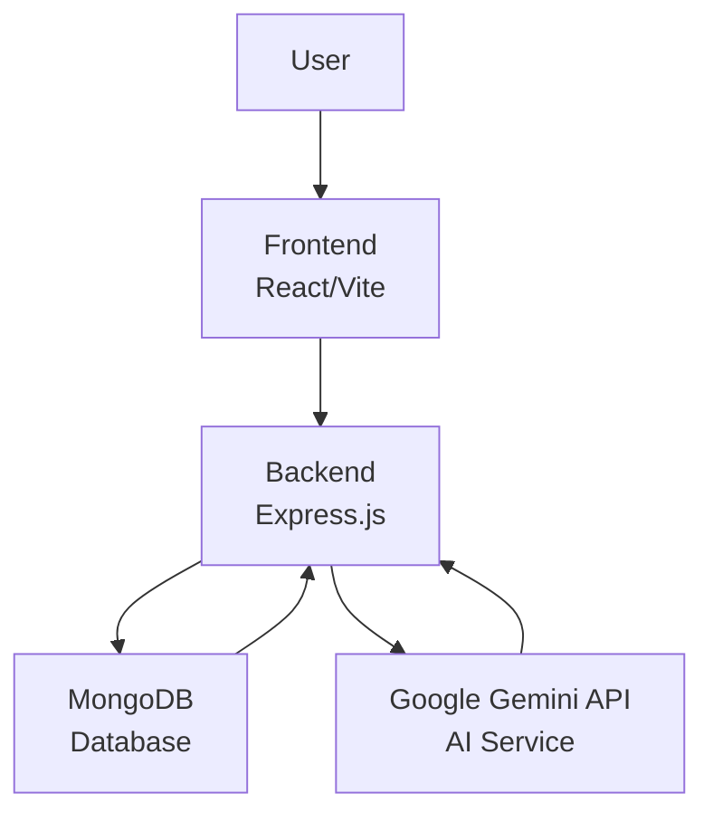

<div align="center">
  
</div>

# 🥗 NutriLens - AI-Powered Nutrition Tracker

NutriLens is a modern web application that leverages the power of Artificial Intelligence to analyze food images and provide detailed nutritional information. Simply upload a photo of your meal, and let Gemini AI break down the calories, protein, carbs, and fats for you.


[](https://opensource.org/licenses/MIT)
[](https://github.com/Yugenjr/GrindMap)
[](https://github.com/Yugenjr/GrindMap)
[](CONTRIBUTING.md)

[](https://nodejs.org/)
[](https://reactjs.org/)
[](https://expressjs.com/)
[](https://www.mongodb.com/)

<div align="center">
  <video src="./screenshots/Demo_Video.mp4" width="100%" controls></video>
</div>


## ✨ Features

- **📸 Image Analysis**: Upload images from your gallery or capture them directly using the camera.
- **🤖 AI-Powered**: Uses Google's Gemini Flash AI model to accurately identify food items and estimate portion sizes.
- **📊 Detailed Insights**: Get a comprehensive breakdown of macronutrients (Calories, Protein, Carbs, Fat).
- **📝 History Tracking**: Automatically saves your scan history to keep track of your dietary intake over time.
- **🌓 Dark/Light Mode**: Fully responsive UI with a sleek dark mode and high-contrast light mode.
- **⚡ Fast & Responsive**: Built with Vite and React for a lightning-fast user experience.

## 📱 Screenshots

### Home Page


### Analysis Result


### History 
 


## 🏗️ Architecture



The application follows a client-server architecture:

- **Frontend**: Built with React and Vite, handles user interactions, image uploads, and displays analysis results.
- **Backend**: Express.js server that processes API requests, manages user authentication, stores analysis history, and integrates with AI services.
- **Database**: MongoDB for storing user data, authentication details, and nutritional analysis history.
- **AI Service**: Google Gemini API for analyzing food images and extracting nutritional information.


## 🛠️ Tech Stack

### Frontend
- **Framework**: [React](https://react.dev/) (via [Vite](https://vitejs.dev/))
- **Styling**: [Tailwind CSS v4](https://tailwindcss.com/)
- **Animations**: [Framer Motion](https://www.framer.com/motion/)
- **Routing**: [React Router](https://reactrouter.com/)
- **Icons**: [Lucide React](https://lucide.dev/)
- **Charts**: [Recharts](https://recharts.org/)

### Backend
- **Runtime**: [Node.js](https://nodejs.org/)
- **Framework**: [Express.js](https://expressjs.com/)
- **Database**: [MongoDB](https://www.mongodb.com/) (with Mongoose ODM)
- **AI Model**: [Google Gemini API](https://ai.google.dev/)
- **File Handling**: Multer

### Tools & DevOps
- **Code Quality**: ESLint, Prettier
- **Language**: TypeScript (Frontend), JavaScript (Backend)

---

## 🚀 Getting Started

Follow these steps to set up the project locally.

### Prerequisites
- Node.js (v18 or higher recommended)
- MongoDB installed locally or a MongoDB Atlas connection string
- A Google Cloud Project with the Gemini API enabled and an API Key

### Installation

1.  **Clone the repository**
    ```bash
    git clone https://github.com/Pranjal6955/NutriLens.git
    cd NutriLens
    ```

2.  **Setup Backend**
    ```bash
    cd backend
    npm install
    ```
    Create a `.env` file in the `backend` directory with the following variables:
    ```env
    PORT=5000
    MONGODB_URI=mongodb://localhost:27017/nutrilens # Or your Atlas URI
    GOOGLE_API_KEY=your_gemini_api_key_here
    CORS_ALLOWED_ORIGINS=http://localhost:5173
    ```

3.  **Setup Frontend**
    ```bash
    cd ../frontend
    npm install
    ```

### Running the Application

1.  **Start the Backend Server**
    ```bash
    cd backend
    npm start
    ```
    The server typically runs on `http://localhost:5000`.

2.  **Start the Frontend Development Server**
    Open a new terminal window:
    ```bash
    cd frontend
    npm run dev
    ```
    The application will be available at `http://localhost:5173`.

---

## 📁 Project Structure

```
NutriLens/
├── backend/                # Node.js/Express Backend
│   ├── config/             # Database configuration
│   ├── models/             # Mongoose models (History, etc.)
│   ├── routes/             # API routes
│   ├── uploads/            # Temporary storage for uploaded images
│   └── server.js           # Entry point
│
├── frontend/               # React Frontend
│   ├── src/
│   │   ├── components/     # Reusable UI components
│   │   ├── pages/          # Page components (Home, History, etc.)
│   │   └── App.tsx         # Main application component
│   └── ...config files     # Vite, Tailwind, ESLint configs
│
└── Readme.md               # Project Documentation
```

## 🧪 Code Quality

This project processes code quality checks using ESLint and Prettier.

- **Linting**: `npm run lint` (in respective directories)
- **Formatting**: `npm run format`

This project is licensed under the ISC License.
